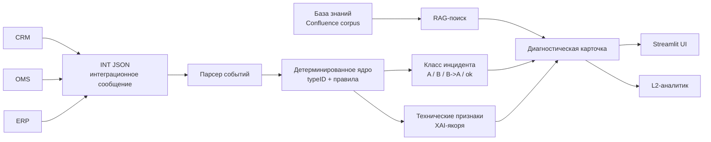
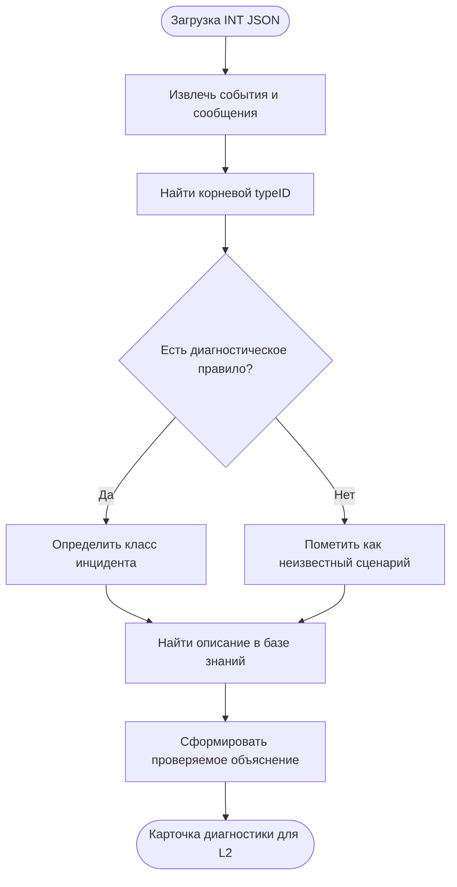
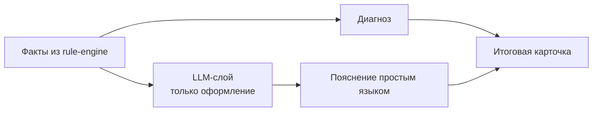
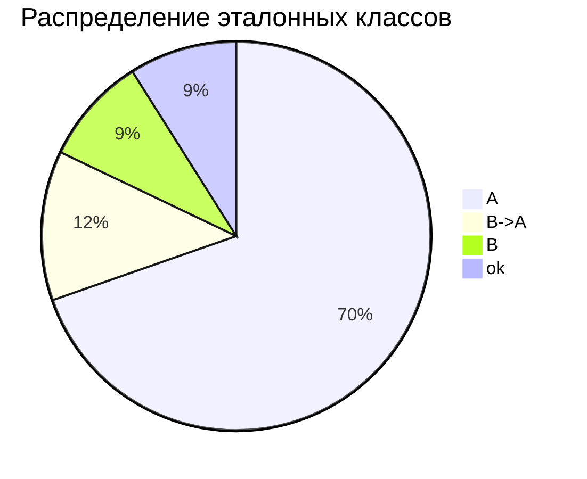
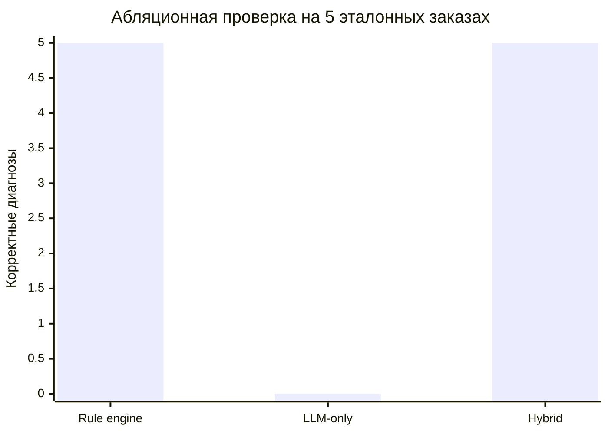

# Гибридная интеллектуальная система диагностики интеграционных ошибок при обработке заказов с интерпретируемым выводом на основе продукционных правил, интеллектуального поиска по базе знаний и больших языковых моделей
## СППР для диагностики ошибок интеграции заказов


Репозиторий содержит учебный прототип системы поддержки принятия решений для первичной диагностики ошибок интеграции заказов в контуре **CRM - OMS - ERP**.

Система переводит ручной L2-разбор INT-инцидентов в проверяемую диагностическую карточку: извлекает корневой `typeID`, определяет класс инцидента, показывает технические признаки ошибки и подбирает релевантные фрагменты базы знаний.

> Версия предназначена для просмотра структуры проекта и подхода к реализации. Реальные корпоративные JSON/XML, выгрузки, внутренние ссылки, pageId, номера заказов и учетные данные не публикуются по причине безопасности разработанного прототипа системы.

## Что реализовано

| Блок | Назначение | Результат для пользователя |
|---|---|---|
| Детерминированное ядро | Разбор INT JSON и извлечение корневого `typeID` | Диагноз не зависит от генеративной модели |
| Классификация инцидента | Определение классов `A`, `B`, `B->A`, `ok` | L2-аналитик сразу видит тип ситуации |
| RAG по базе знаний | Поиск релевантных фрагментов документации | Диагностическая карточка содержит объяснение и источник |
| XAI-якоря | Ссылки на технические признаки: `dateTime`, `messageId`, `typeID`, pageId | Вывод можно проверить по исходным данным |
| Streamlit-интерфейс | Прототип пользовательского окна СППР | Можно показать работу программы без промышленного внедрения |

## Архитектура решения



## Логика диагностики



## Роль LLM в прототипе

LLM не ставит диагноз и не выбирает первопричину. Генеративная модель используется только как дополнительный слой форматирования текста на основании уже найденных фактов.



## Метрики из дипломной работы

| Показатель | Значение | Интерпретация |
|---|---:|---|
| Совпадение корневого `typeID` для класса A | `39/39` | На эталонной выборке класс A определен без расхождений |
| Сценарий переклассификации `B->A` | `6/6` | Ошибка корректно переносится к корневому техническому признаку |
| Среднее время ядра диагностики | `214,6 мс` | Расчет выполняется интерактивно для пользователя |
| P95 времени ядра диагностики | `453,6 мс` | Большинство запусков остается быстрее 0,5 секунды |
| Абляционный тест | `5/5` hybrid, `5/5` rule engine, `0/5` LLM-only | Ключевую точность обеспечивает детерминированное ядро |





## Структура проекта

| Файл | Роль |
|---|---|
| `src/sppr_streamlit_app.py` | Главное окно Streamlit-прототипа |
| `src/sppr_diagnose.py` | Детерминированная диагностика и правила |
| `src/sppr_analyze.py` | Разбор интеграционных событий и подготовка признаков |
| `src/sppr_confluence_rag.py` | Поиск по локальному корпусу базы знаний |
| `src/sppr_llm.py` | Опциональный LLM-слой для текстового объяснения |
| `src/sppr_json_qa.py` | Вопросы к JSON и вспомогательный анализ |
| `src/sppr_ui_render.py` | Отрисовка диагностических карточек |
| `src/diploma_metrics.py` | Расчет и представление метрик дипломной работы |

## Быстрый запуск

```bash
pip install -r requirements.txt
streamlit run src/sppr_streamlit_app.py
```

Без закрытого корпуса данных интерфейс можно открыть для просмотра структуры программы, но полный end-to-end запуск диагностики требует локальной папки с обезличенными INT JSON и базой знаний.

## Что не опубликовано

| Не публикуется | Причина |
|---|---|
| Реальные JSON/XML интеграции | Содержат внутренние бизнес-данные |
| CSV-реестры инцидентов | Могут содержать номера заказов и технические детали |
| Экспорты Confluence/Jira | Содержат внутреннюю документацию |
| `.env`, токены, ключи API | Секреты и учетные данные |
| Внутренние URL, pageId, номера заказов | Идентификаторы корпоративной инфраструктуры |

## Назначение репозитория

Этот репозиторий показывает архитектуру и реализацию учебного прототипа СППР:

1. как из интеграционного сообщения выделяется корневая ошибка;
2. почему диагноз является проверяемым;
3. как RAG дополняет диагностику ссылкой на базу знаний;
4. как пользователь видит результат в интерфейсе;
5. почему LLM не подменяет детерминированную бизнес-логику.

Проект подготовлен для демонстрации в рамках выпускной квалификационной работы.
